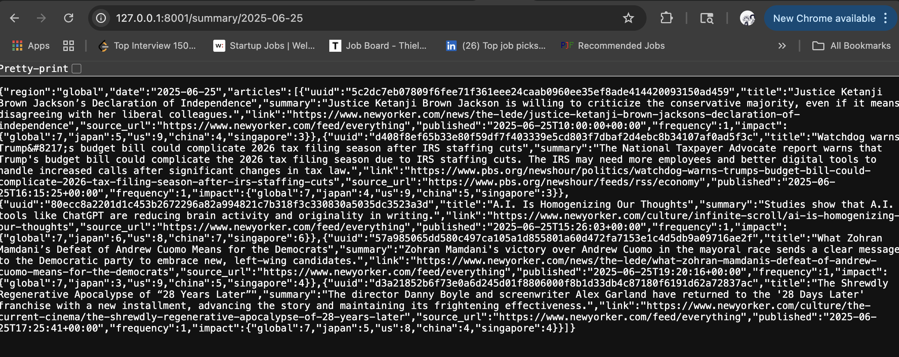

# News Summary Backend

This backend aggregates, summarizes, and serves news articles from various sources. It fetches RSS feeds, summarizes them using AI (OpenAI), and offers an API to retrieve top news per region.

## Requirements

Using either Go or Python, this backend:

* Aggregates news articles from RSS feeds
* Uses AI (e.g., OpenAI API) to identify and summarize the top 5 news items of the day
* Stores data using plain text files (JSON)
* Offers endpoints to:

  * Retrieve today’s top 5 summaries
  * Retrieve summaries from previous days

## Project Structure

```text
news_summary_backend/
├── app/
│   ├── api/                # FastAPI routes for summary access
│   ├── config/             # Region and port config files
│   │   └── regions.json
│   └── core/
│       ├── fetcher/        # Fetches RSS articles and sends notification
│       │   └── fetcher.py
│       ├── sender/         # Sends socket message to receiver
│       │   └── sender_us.py
│       ├── summarizer/     # Summarizes and scores articles
│       │   ├── summarizer.py
│       │   └── topk_precomputer.py
│       └── receiver/       # Region-based receiver for fetch events
│           └── receiver.py
├── data/
│   ├── raw/                # Incoming fetched files by region and date
│   │   └── {region}/{date}/source/fetched_{timestamp}.json
│   ├── archive/            # Processed fetched files (moved here after summarization)
│   ├── score_cache/        # Stores article summary + impact score per UUID
│   ├── top_k_cache/        # Stores top-5 daily summaries per region
│   ├── cache/
│   │   └── article_status/ # Tracks article processing states
│   └── log/
│       └── process_log/    # Summarization logs
│           └── summarizer_{region}_{timestamp}.json
├── .venv/                  # Python virtual environment
├── requirements.txt        # Python dependencies
└── README.md               # Project documentation
```

## Setup

1. Clone the repository

```bash
git clone https://github.com/Sinadalee/news_summary_backend.git
cd news_summary_backend
```

2. Create virtual environment and install dependencies

```bash
python -m venv .venv
source .venv/bin/activate
pip install -r requirements.txt
```

3. Add your OpenAI API key to `.env`:

```
OPENAI_API_KEY=your_key_here
```

## Running the System

### Sender

Fetches RSS and notifies the receiver:

```bash
.venv/bin/python app/core/sender/sender_us.py
```

Schedule it via cron:

```cron
* * * * * /path/to/.venv/bin/python /path/to/project/app/core/sender/sender_us.py >> /tmp/sender.log 2>&1
```

### Receiver

Listens for fetch notifications and runs summarization + top K:

```bash
.venv/bin/python app/core/receiver/receiver.py
```

Port is defined in `app/config/ports.json`.

## API Endpoints

### Get today’s summary for a region (default: us)

```http
GET /summary/today?region=us
```

### Get summary by date and region

```http
GET /summary/{date}?region=us
```

Date format: `YYYY-MM-DD`

## Notes

* Summarizer avoids duplicates by using article UUID (based on title+link).
* After summarizing, raw files are moved to `data/archive/{region}/{date}` to prevent reprocessing.
* Top-K computation is timezone-aware using region's local time.
* Status and process logs are stored in plain JSON for transparency.
* The `article_status.json` tracks pending and completed processing state.

## Design Overview

The backend performs the following tasks:

* Periodically fetches RSS feed articles
* Deduplicates and summarizes articles using AI (e.g., OpenAI GPT)
* Scores and ranks articles by relevance and frequency
* Stores raw, intermediate, and final output data in organized directories
* Exposes a REST API for accessing top summaries per region and date

# Rational and Design Choices

This document outlines key decisions and design trade-offs made while developing the news summarization backend.

## LLM Impact Design

Originally, the plan was to use view counts to determine importance, but RSS feeds do not provide view statistics. To address this, we designed a new scoring system based on:

* **Frequency**: how often the same article appears across multiple sources.
* **Impact**: score calculated by the LLM with regional context 

## Timezone-Aware Summarization

Each region is associated with a specific timezone. Articles are grouped by their localized publish date. This ensures that users in different regions receive timely summaries according to their own day cycle.

## Regional Decoupling

The system is designed to operate independently by region. This allows:

* Deployment across different servers or cloud regions in the future
* Parallel processing and fault isolation
* Per-region tuning (e.g., language, summary preferences)

## Distributed Architecture via Socket

The sender (fetcher) and receiver (summarizer) are decoupled:

* **Sender** fetches data and sends metadata via socket
* **Receiver** listens and processes updates per region

This separation allows scaling components independently.

## Data Storage Decisions

| Component            | Recommended Storage | Current Design                    | Notes                                               |
| -------------------- | ------------------- | --------------------------------- | --------------------------------------------------- |
| Raw Fetched Articles | Amazon S3 + Glacier | JSON in `/data/raw/`              | Move to archive after processing                    |
| Summarized Articles  | Amazon S3           | `/data/score_cache/`              | Organized by region/date                            |
| Top-K Summaries      | S3 / Cloud CDN      | `/data/top_k_cache/`              | Cached daily per region                             |
| Status Tracking      | DynamoDB            | `/data/cache/article_status.json` | Could benefit from random-access and atomic updates |
| Process Logs         | CloudWatch / S3     | `/data/log/`                      | Useful for debugging / auditing                     |

## Cost Efficiency

The system includes a flag `use_llm=False` for:

* Local testing without calling OpenAI
* Preserving token usage during development

## De-Duplication Logic

* Articles are hashed using title + link to create UUID
* Status file tracks processed UUIDs
* Newly fetched articles are skipped if their UUID is already marked

This avoids reprocessing old news and saves API usage.

## RSS Timestamp vs. Fetch Time

RSS `published` timestamps can be delayed or inaccurate. To avoid missing articles:

* We compare publish time in article vs. fetch timestamp in the filename
* A better design would involve querying DynamoDB for existing UUIDs in a time window

## Evolution of Region Design

Originally, the system computed impact scores per article for multiple regions, using region-specific weights. This allowed a US-based article to appear in Japan’s top news if it had high regional impact.

### Change in Direction

Instead of applying scores across regions, we now fetch from region-specific news sources.

### Pros and Cons Comparison

| Approach                         | Pros                                       | Cons                                            |
| -------------------------------- | ------------------------------------------ | ----------------------------------------------- |
| Multi-region scoring per article | Maximizes reuse of global news sources     | Foreign news might dominate local top-K results |
| Region-specific feeds (current)  | Better reflects local interest and context | May omit relevant international events          |

## Summary

This backend trades real-time generalization for region-specific accuracy. It favors transparency, debuggability, and portability over high-throughput infrastructure, making it ideal for small-scale deployments or academic experimentation.

# Deploying Global Logic

## Problem Statement

If each region (e.g., JP, US, CN) stores its news data in its own local cloud region (e.g., Tokyo, N. Virginia), what happens when a user from one region requests data from another? How do we ensure low latency, reliability, and cost-efficiency?

## Proposed Architecture

1. **Regional Storage**:

   * JP data is stored in Tokyo (e.g., S3 JP, DynamoDB JP).
   * US data is stored in N. Virginia (e.g., S3 US, DynamoDB US).

2. **User Query Flow**:

   * User in US queries for JP data: API Gateway US forwards query to Tokyo.
   * Response is returned to US API server, and optionally cached.

3. **Cross-Region Caching** (Optional):

   * Cache popular queries in the user's region (e.g., Redis or CDN edge cache).
   * Use time-based eviction or content-based TTL (e.g., per summary's date).

4. **Failover and Redundancy**:

   * If JP service fails, fallback to a replicated cold backup (e.g., S3 Glacier in US).

---

## Sample Query Flow

```text
User (US) --query--> US API Gateway --forward--> JP summarizer endpoint -->
JP DB + S3 (load data) --> summarized response --> US API --> User
```

Optional:

* Cache result in US Redis for next query.

---

## Sample Screenshot of Output


Scores in screenshots are 0 because OpenAI API is disabled to avoid further billing. $2 was spent debugging, which is the maximum budget for this prototype.

---

## Pros

* Data locality ensures compliance and low latency for native users.
* Scales easily by replicating deployment per region.
* Easier to rate-limit traffic regionally.

## Cons

* Cross-region latency for foreign queries.
* Duplicate caching/transfer costs.
* Harder to maintain consistency if summaries change frequently.

---

## Future Work

* Add region-specific edge cache layer (CloudFront, Fastly).
* Add region-aware cache invalidation.
* Explore GraphQL federation for multi-region summary fetching.

---

## Related Files

* `app/config/regions.json` — region setup
* `data/top_k_cache/{region}/{date}.json` — top summaries by region/date
* `receiver_main.py` — region listener for processing updates

---

## Suggested Improvements

* Cache popular foreign-region results with LRU or TTL cache.
* Batch requests from same region to minimize cross-region calls.
* Use message queue for async background cache update.


